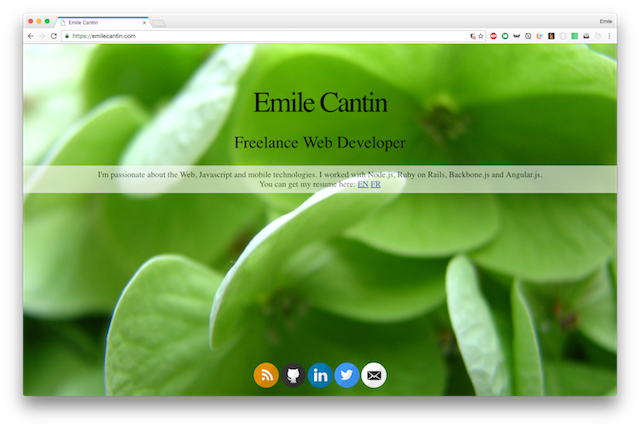

class: center, middle

# Introduction au HTML

---

# Objectif à atteindre

- Être en mesure d'écrire une page Web simple
- Avoir les bases pour pouvoir aller plus loin

---

# Plan

1. Qu'est-ce que le HTML?
1. Environnement (_setup_)
1. Concepts de base
1. Squelette d'une page
1. Quelques balises
1. Exercices
1. Références
1. Pistes à explorer

---

class: center, middle
# Qu'est-ce que le HTML?

???

Navigateur demande une page, serveur répond du HTML

---

```html
<!DOCTYPE html>
<html>
<head>
	<link href="http://fonts.googleapis.com/css?family=Open+Sans:300,400,700" rel="stylesheet" type="text/css">
	<link href="style.css" rel="stylesheet" type="text/css">
	<title>Emile Cantin</title>
</head>
<body>
	<h1>Emile Cantin</h1>
	<h2>Freelance Web Developer</h2>
	<div class="container">
		<p>I'm passionate about the Web, Javascript and mobile technologies. I worked with Node.js, Ruby on Rails, Backbone.js and Angular.js. You can get my resume here:
			<a href="https://docs.google.com/document/d/1fDff1oEuhEEc8t9Q-RMkW3xzQanjpWDiLiuSXMKDLAo/edit?usp=sharing">EN</a>
			<a href="https://docs.google.com/document/d/1iduRtaJAssoVJ-mIGk2h4zBdW5qeifg9Xmg1Q0HE0PY/edit?usp=sharing">FR</a></p>
	</div>
	<ul class="links">
		<li><a href="http://blog.emilecantin.com" class="sprite-blog"></a></li>
		<li><a href="https://github.com/emilecantin" class="sprite-github"></a></li>
		<li><a href="https://ca.linkedin.com/in/emilecantin" class="sprite-linkedin"></a></li>
		<li><a href="https://twitter.com/emilecantin" class="sprite-twitter"></a></li>
		<li><a href="mailto:emile.cantin@gmail.com" class="sprite-email"></a></li>
	</ul>
</body>
</html>
```
---

.center.middle[]

---
# Qu'est-ce que le HTML?

- Langage de notation
  - **H**yper **T**ext **M**arkup **L**anguage

---

# Environnement

- Éditeur de texte
  - Sublime Text, Atom, VS Code, Notepad++, gedit, vim
  - PAS Word, Pages ou OneNote
- Navigateur Web
  - Google Chrome, Firefox, Safari, Edge

???

- S'assurer que tout le monde a un éditeur de texte convenable
  - [Sublime](http://www.sublimetext.com/)
  - [Atom](https://atom.io/)
  - [VS Code](https://code.visualstudio.com/)
  - [Notepad++](https://notepad-plus-plus.org/)
- S'assurer que tout le monde a un navigateur convenable
  - Parler de IE, des dev tools, etc.

---

# Concepts de base

## Balise HTML:

```html
<p>
  contenu
</p>
```

---

# Squelette d'une page HTML

```html
<!DOCTYPE html>
<html>
  <head>
    <title>Titre!</title>
  </head>
  <body>
    <!-- contenu ici! -->
  </body>
</html>
```

???

- Doctype: pour dire au navigateur que c'est du HTML
- Balises ouvrantes et fermantes
- `html`: Le document
  - `head`: l'en-tête du document (non visible dans la page)
      - `title`: le titre de la page
  - `body`: Le corps du document (visible dans la page)
      - commentaire

---

# Quelques balises

Ceci est un paragraphe
```html
<p>Ceci est un paragraphe</p>
```

# Ceci est un titre
```html
<h1>Ceci est un titre</h1>
```

## Ceci est un sous-titre
```html
<h2>Ceci est un sous-titre</h2>
```

---

# Quelques balises (suite)

1. Liste
1. numérotée

```html
<ol>
  <li>Liste</li>
  <li>numérotée</li>
</ol>
```

- Liste
- non-numérotée

```html
<ul>
  <li>Liste</li>
  <li>non-numérotée</li>
</ul>
```

---

# Quelques balises (suite)

Ceci est un paragraphe contenant du **gras** et de l'*italique*
```html
<p>
  Ceci est un paragraphe contenant du <strong>gras</strong>
  et de l'<em>italique</em>
</p>
```

[Ceci est un lien](http://emilecantin.com)
```html
<a href="http://emilecantin.com">Ceci est un lien</a>
```

???

Parler des attributs

---
class: center, middle

# Exercices

???

[demo](/html/demo)

1. Recopier le squelette HTML
2. Ajouter un titre sur la page
3. Ajouter une liste
4. Transformer un item de la liste en lien
5. Faire quelques paragraphes

Et plus au besoin, selon la compréhension

---

# Références

- Google
--

- [Mozilla Developers Network (MDN)](https://developer.mozilla.org/fr/docs/Web/HTML)
--

- Stack Overflow

---

# Pistes à explorer

- CSS
- Javascript
- Serveur
- Hébergement
- Noms de domaine
- Bases de données
- etc...

???

Idées de démo, si on a du temps:

- CSS:
  - Styler quelques éléments dans la page
  - Image d'arrière plan
  - (Montrer les dev tools de Chrome)
- Javascript:
  - Ajouter des éléments au onClick d'un bouton
  - Lire un input pour faire quelque chose de différent
  - (Montrer les dev tools de Chrome)
  - Faire une requête au serveur avec fetch
  - Parler de node.js, React, React-Native
